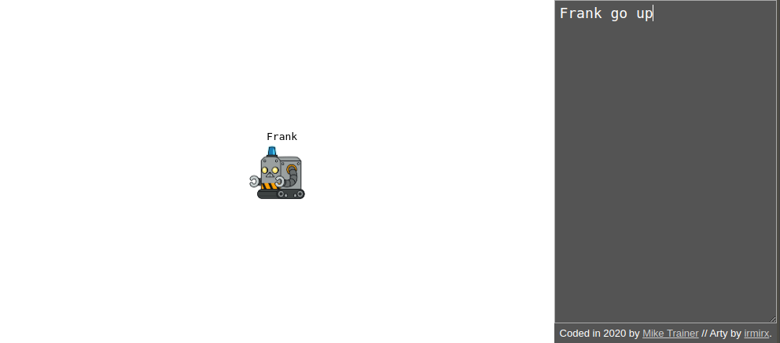

# Code Monsters
An extremely simple coding toy for kids. It allows control of the characters on screen with simple commands.
[See it in action...](https://mpicpus.github.io/code_monsters1/)


### Commands:
Command syntax is:
```ruby
<name|'all'> <command> <option/s>
Frank go up
all stop
```
#### Available commands:
- `go <direction: up|down|righ|left>`: will move the character in the given direction.
- `stop`
- `rename <newName>`
- `make <newName>`: will create a new character. We always command another char to perform this operation, like: `Frank make Gail`
- `speed <direction: up|down>`: will increase/decrease char speed.

[_more coming..._]